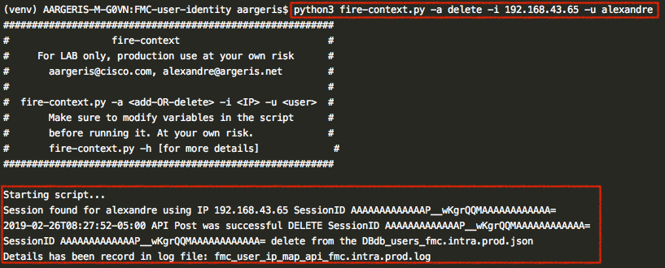

         
# Cisco FMC API User Context
  
This repo contains a Python script that simplifies adding or deleting users from IP passive mapping in Cisco FMC. All new mappings are saved in a database called `db_users_fmc.'YOUR-DOMAIN-NAME'.json`. 

This script leverages the user agent REST API used by the Cisco Terminal Services (TS) Agent. Description of this API can be found [here](https://www.cisco.com/c/en/us/td/docs/security/ise/2-2/pic_admin_guide/PIC_admin/PIC_admin_chapter_011.html#id_38498).
  
Please contact me at alexandre@argeris.net, if you have any questions or remarks. If you find any bugs, please report them to me, and I will correct them. 
  
### VARIABLES TO MODIFY BEFORE RUNNING THE SCRIPT
  
  

### EXAMPLES
  
ADDING a user/ip mapping:

DELETING a user/ip mapping:

  
In your FMC you should see the following result :

